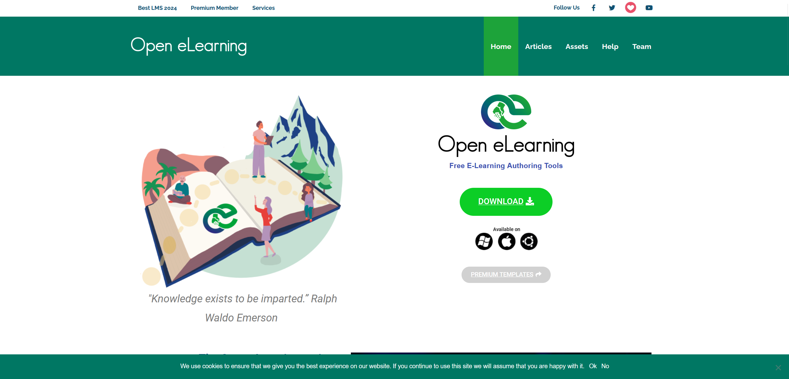
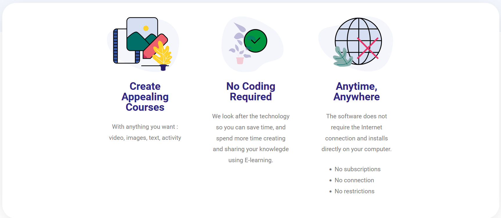
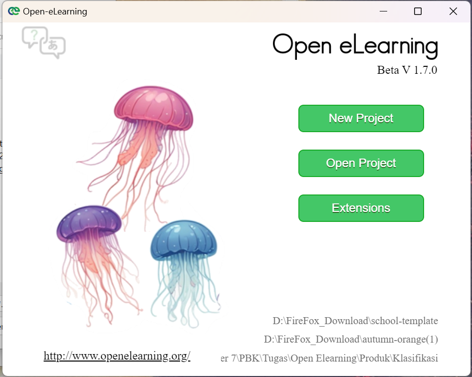
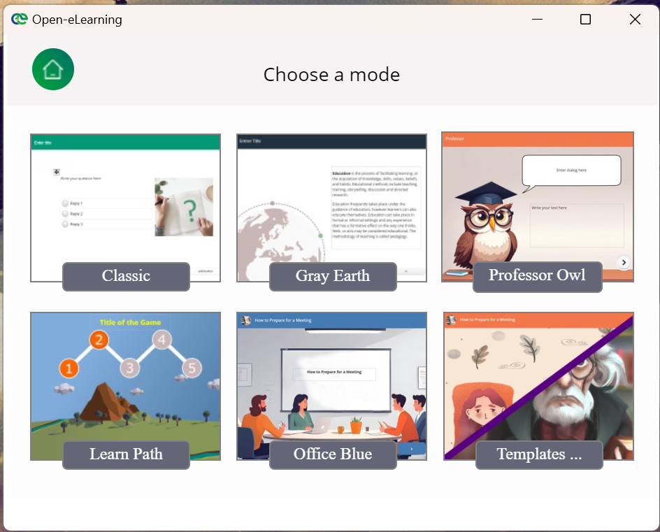
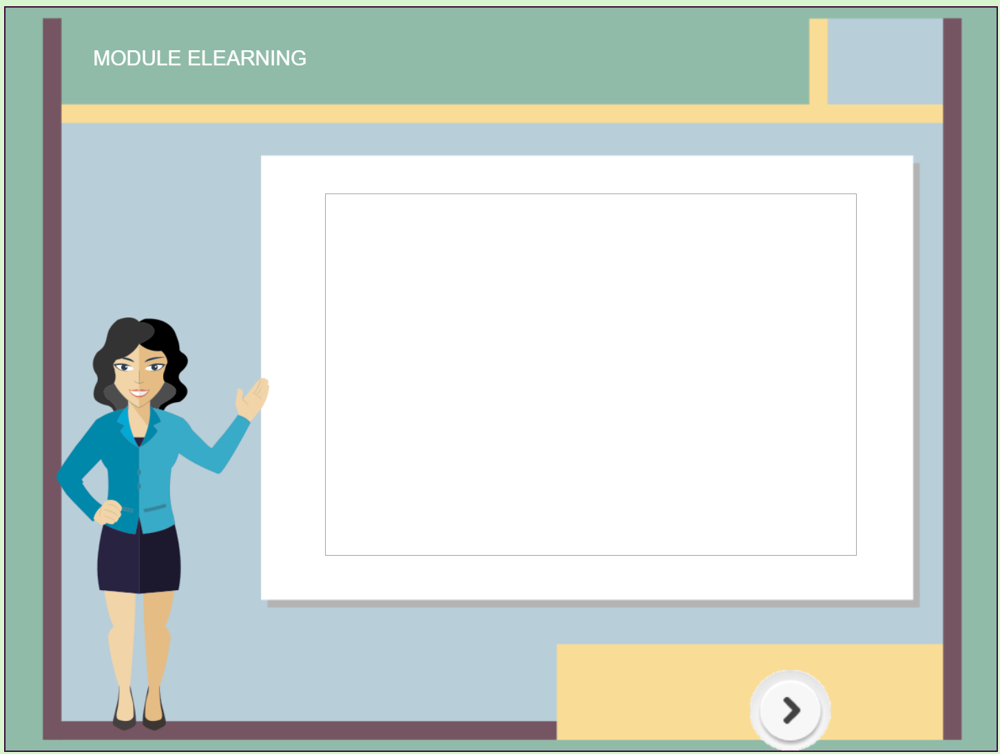
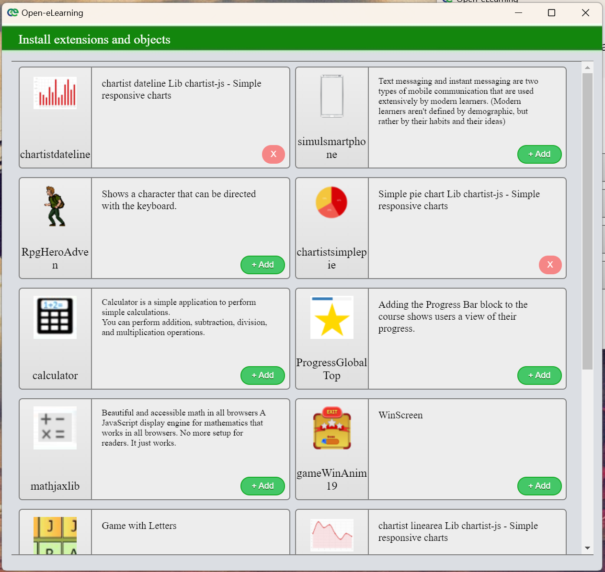

# Open Elearning

---

Open eLearning adalah perangkat lunak open-source yang dirancang untuk membuat konten e-learning dengan mudah. Sejak diluncurkan pada tahun 2018, alat ini telah diunduh lebih dari 78.000 kali, mencerminkan popularitasnya di kalangan pengembang pendidikan online. Keunggulan utama Open eLearning adalah sifatnya yang sepenuhnya gratis, memungkinkan pengguna dari berbagai kalangan untuk mengakses fitur-fitur canggih dalam merancang kursus atau pelatihan online. 

Salah satu fitur penting dari Open eLearning adalah kompatibilitasnya dengan SCORM (Sharable Content Object Reference Model). Ini memungkinkan konten yang dibuat dengan Open eLearning dapat dengan mudah diintegrasikan ke dalam Learning Management Systems (LMS) yang ada, memastikan bahwa kursus dapat diakses dan dilacak dengan efisien oleh pengelola platform pendidikan. Fitur ini sangat penting bagi institusi pendidikan dan perusahaan yang menginginkan sistem yang terintegrasi dan mudah dipantau.

Open eLearning dapat diinstal di berbagai platform, termasuk Windows, macOS, dan Linux, menjadikannya pilihan fleksibel untuk berbagai pengguna, baik individu maupun organisasi. Dengan dukungan multiplatform ini, perangkat lunak ini memungkinkan penggunanya untuk mengembangkan dan menyebarkan kursus di berbagai lingkungan teknis, memperluas jangkauannya di seluruh dunia.

Bagi pengguna yang tertarik, Open eLearning dapat diakses melalui situs web resmi mereka di [https://www.openelearning.org](https://www.openelearning.org), yang menyediakan dokumentasi, tutorial, dan sumber daya tambahan untuk memaksimalkan penggunaan perangkat lunak ini.

---

## Fitur
---

1. **Create Appealing Courses**

Salah satu keunggulan Open eLearning adalah kemampuannya untuk membantu pengguna merancang kursus yang tidak hanya kaya informasi, tetapi juga menarik secara visual. Dengan mendukung penambahan elemen multimedia seperti gambar, video, dan animasi interaktif, materi pembelajaran menjadi lebih dinamis dan mudah dipahami oleh peserta. Selain itu, Open eLearning menyediakan berbagai template siap pakai yang mempermudah proses desain. Pengguna dapat memilih template yang sesuai, menyesuaikan konten, dan menambahkan elemen kreatif tanpa harus memulai dari awal, menghasilkan kursus yang terlihat profesional dan menarik, serta mampu meningkatkan motivasi peserta dalam belajar.

2. **No Coding Required**

Keunggulan lain dari Open eLearning adalah kemudahan penggunaannya, bahkan bagi mereka yang tidak memiliki latar belakang teknis. Dengan antarmuka drag-and-drop yang sederhana, pembuatan kursus menjadi sangat mudah. Pengguna hanya perlu memilih elemen yang diinginkan, menyeretnya ke dalam kanvas kerja, dan menyesuaikan tampilannya sesuai kebutuhan. Fitur ini menghapus hambatan teknis dan mempercepat proses pembuatan kursus, memungkinkan pengguna untuk lebih fokus pada pengembangan materi pembelajaran daripada hal-hal teknis.

3. **Anytime, Anywhere**

Open eLearning mendukung model pembelajaran fleksibel yang semakin relevan dengan gaya hidup modern. Kursus yang dibuat dengan perangkat lunak ini responsif, sehingga dapat diakses melalui berbagai perangkat seperti laptop, tablet, atau smartphone. Peserta dapat mengakses materi kapan saja dan di mana saja, tanpa khawatir tentang masalah kompatibilitas perangkat atau batasan waktu dan tempat. Fitur ini memberikan kebebasan bagi peserta yang memiliki jadwal sibuk atau mobilitas tinggi, memungkinkan mereka untuk belajar baik di rumah, kantor, atau bahkan saat sedang dalam perjalanan.

---

## Preview

Tampilan Awal 

Saat membuka aplikasi akan muncul tampilan seperti diatas

---
Tampilan saat mengklik "New Project" yang akan memberikan kita template

---

Tampilan saat mengklik "Open Project" yang mana akan membuka file pekerjaan kita sebelumnya

---

Tampilan saat mengklik "Extension" yang akan memberikan kita pilihan ekstensi yang bisa kita gunakan untuk projek kita
